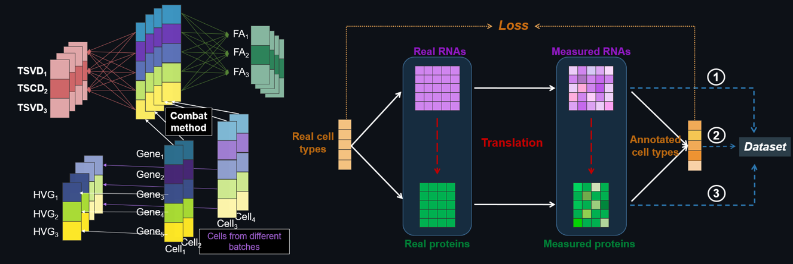

# scMMT

[](https://doi.org/10.1093/bib/bbad523)
[](https://github.com/SongqiZhou/scMMT/actions/workflows/ci.yml)
[](https://pypi.org/project/scMMT/)
[](LICENSE)

**scMMT** (single-cell multi-modal data and multi-task learning tool) is the
official implementation accompanying the 2024 *Briefings in Bioinformatics*
paper:

> **scMMT: a multi-use deep learning approach for cell annotation, protein
> prediction and embedding in single-cell RNA-seq data**
> Songqi Zhou, Yang Li, Wenyuan Wu, and Li Li
> [Journal article](https://doi.org/10.1093/bib/bbad523) ·
> [PubMed Central](https://pmc.ncbi.nlm.nih.gov/articles/PMC10833085/)

scMMT learns from one or more annotated scRNA-seq or paired CITE-seq reference
datasets and applies the learned representation to a query scRNA-seq dataset.
One fitted model supports three connected tasks:

- **Cell-type annotation** of query cells.
- **Surface-protein prediction** from RNA expression.
- **Low-dimensional embedding** of reference and query cells in a shared space.



## How the method works

The implementation follows the paper's two-part design:

1. **Multi-view RNA preprocessing.** Normalized RNA counts are represented by
   highly variable genes (HVGs), truncated SVD features, and factor-analysis
   features. Optional ComBat correction is applied before TSVD/FA when a query
   dataset is present.
2. **Multi-task residual network.** A shared residual network produces an
   embedding, followed by independent cell-type and protein heads. Label
   smoothing and logarithmic class weights improve robustness to noisy and rare
   labels. GradNorm dynamically balances the two task losses.

Protein measurements from references with different antibody panels are merged
with a censored MSE: only proteins observed in a given source dataset contribute
to that cell's protein loss. Passing RNA-only references disables the protein
task while retaining annotation and embedding.

## Installation

Python 3.10–3.12 is supported. A fresh environment is recommended:

```bash
conda create -n scmmt python=3.10
conda activate scmmt
python -m pip install --upgrade pip
```

Install the latest maintained source:

```bash
pip install "git+https://github.com/SongqiZhou/scMMT.git"
```

For development:

```bash
git clone https://github.com/SongqiZhou/scMMT.git
cd scMMT
pip install -e ".[test]"
```

Intel-optimized scikit-learn is optional rather than required:

```bash
pip install -e ".[intel]"
```

The existing PyPI package can be installed with `pip install scMMT`; check its
displayed version when exact reproducibility matters.

## Input contract

The high-level API consumes `AnnData` objects:

| Input | Required structure |
| --- | --- |
| `gene_trainsets` | Non-empty list of RNA `AnnData` references; genes are columns. |
| `protein_trainsets` | One aligned protein `AnnData` per RNA reference, or `None` for RNA-only training. |
| `gene_test` | Optional query RNA `AnnData`; needed for `predict()`. |
| Cell indices | RNA and protein observations in each reference must have identical names and order. |
| `type_key` | Cell-type column in each reference's `.obs`; omit to disable annotation. |
| Batch keys | Optional `.obs` columns supplied through `train_batchkeys` and `test_batchkey`. |

Raw counts should be supplied when the default cell normalization and `log1p`
steps are enabled. Protein values can be normalized independently before being
passed to scMMT; the tutorial uses total-count normalization, `log1p`, and
per-donor scaling.

## Quick start

```python
import scanpy as sc
from scMMT import scMMT_API

rna = sc.read_h5ad("pbmc_gene.h5ad")
protein = sc.read_h5ad("pbmc_protein.h5ad")

is_reference = rna.obs["donor"].isin(["P1", "P3", "P4", "P7"])
rna_reference = rna[is_reference].copy()
protein_reference = protein[is_reference].copy()
rna_query = rna[~is_reference].copy()

model = scMMT_API(
    gene_trainsets=[rna_reference],
    protein_trainsets=[protein_reference],
    gene_test=rna_query,
    train_batchkeys=["donor"],
    test_batchkey="donor",
    type_key="celltype.l3",
    min_cells=0,
    min_genes=0,
    n_svd=300,
    n_fa=180,
    n_hvg=550,
    log_weight=3,
    val_split=None,
    data_dir="preprocessed.pkl",
)

model.train(
    n_epochs=100,
    ES_max=12,
    decay_max=6,
    label_smoothing=0.4,
    h_size=600,
    drop_rate=0.15,
    n_layer=4,
    weights_dir="scmmt_weights.pt",
)

predictions = model.predict()
imputed_reference_proteins = model.impute()
joint_embedding = model.embed()
```

`predict()` returns an `AnnData` object whose matrix contains predicted protein
values. Predicted labels are stored in
`predictions.obs["transferred cell labels"]`; the historical misspelled key
`"transfered cell labels"` remains available for older notebooks.

### Loading a checkpoint

Construct the API with the same preprocessing and network dimensions, then use:

```python
model.train(
    h_size=600,
    drop_rate=0.15,
    n_layer=4,
    weights_dir="scmmt_weights.pt",
    load=True,
)
```

### RNA-only annotation

Set `protein_trainsets=None` and provide `type_key`. scMMT automatically trains
only the cell-type head and does not evaluate an empty protein loss:

```python
model = scMMT_API(
    gene_trainsets=[rna_reference],
    protein_trainsets=None,
    gene_test=rna_query,
    type_key="celltype.l3",
    val_split=None,
)
```

## Main parameters

| Parameter | Default | Meaning |
| --- | ---: | --- |
| `min_genes` | 200 | Minimum expressed genes retained per cell; use `0` to disable. |
| `min_cells` | 30 | Minimum cells expressing a gene; use `0` to disable. |
| `n_svd` | 300 | Requested TSVD components (capped for small inputs). |
| `n_fa` | 64 | Requested factor-analysis components (capped for small inputs). |
| `n_hvg` | 1000 | Number of highly variable genes. |
| `dataset_batch` | `True` | Apply reference/query ComBat correction before TSVD and FA. |
| `val_split` | `"by_test"` | Select reference neighbours of query cells; use `None` for a random split. |
| `log_weight` | `None` | Additive constant inside logarithmic class weighting; `"no_log"` uses balanced weights directly. |
| `data_dir` | `None` | Optional trusted preprocessing-cache path. |

## Datasets used in the paper

| Dataset | Cells | Genes | Proteins | Cell types | Source |
| --- | ---: | ---: | ---: | ---: | --- |
| Seurat v4 160k PBMC | 161,764 | 20,729 | 224 | 8 / 31 / 58 | [GSE164378](https://www.ncbi.nlm.nih.gov/geo/query/acc.cgi?acc=GSE164378) |
| H1N1 PBMC | 53,201 | 32,738 | 87 | — | [Data collection](https://doi.org/10.35092/yhjc.c.4753772) |
| COVID-19 | 647,366 | 24,737 | 192 | 50 | [E-MTAB-10026](https://www.ebi.ac.uk/biostudies/arrayexpress/studies/E-MTAB-10026) |
| Simulation | 20,000 | 20,729 | 224 | 4 | [GitHub release](https://github.com/SongqiZhou/scMMT/releases/tag/scMMT) |

Prepared copies previously shared for sciPENN experiments are available from
the [University of Pennsylvania Box folder](https://upenn.app.box.com/s/1p1f1gblge3rqgk97ztr4daagt4fsue5).
Users remain responsible for checking the original dataset terms and metadata.

## Reproducibility and scope

- The default seed controls NumPy, PyTorch, validation sampling, TSVD, and FA.
- Exact paper numbers require the paper's dataset partitions, preprocessing,
  hyperparameters, and hardware—not only the short quick-start example.
- `data_load=True` uses Python pickle and must only be used with a trusted cache.
- scMMT is a research tool. Predicted biological labels and protein values
  require domain validation before clinical or diagnostic interpretation.

Run the regression suite with:

```bash
pytest
ruff check .
```

## Citation

```bibtex
@article{zhou2024scmmt,
  title   = {scMMT: a multi-use deep learning approach for cell annotation,
             protein prediction and embedding in single-cell RNA-seq data},
  author  = {Zhou, Songqi and Li, Yang and Wu, Wenyuan and Li, Li},
  journal = {Briefings in Bioinformatics},
  volume  = {25},
  number  = {2},
  pages   = {bbad523},
  year    = {2024},
  doi     = {10.1093/bib/bbad523}
}
```

## License and support

The code is released under the [MIT License](LICENSE). Please use
[GitHub Issues](https://github.com/SongqiZhou/scMMT/issues) for reproducible bug
reports, including package versions, the failing command, and a minimal data
description that does not expose sensitive donor information.
